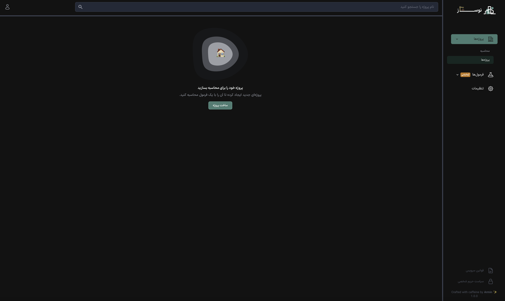
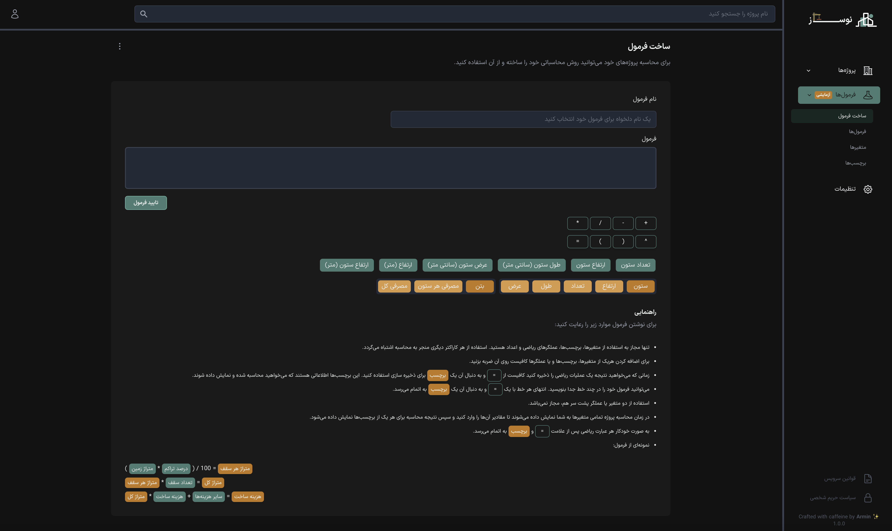

<h2 align="center">
Nosaz
 
 

</h2>

## About

Nosaz is an experimental application designed for constructors and engineers to assist with project calculations. I built this in my free time, so it may contain bugs or incomplete features. Please note: **Nosaz** is not intended for production use.

    <table style="border: none" align="center">
        <tr>
            <td style="padding:10px" align="center">
                
            </td>
            <td style="padding:10px" align="center">
                
            </td>
        </tr>
    </table>

## Install

1.  Rename `.env.example` to `.env`.
2.  Inside `.env` set app url and database configs.
3.  Set up required configs for Mailtrap (or any other mail service), Google OAuth, Twitter OAuth, Telegram OAuth, and hCaptcha.
4.  Replace Firebase messaging configs with yours in `public/firebase-messaging-sw.js` and `resources/js/firebase.js`. (This step is optional, as the feature is still a work in progress.).
5.  Run `compose install` and `npm install`
6.  Run `php artisan key:generate` & `php artisan migrate`.

## License

The panel is open-sourced software licensed under the [MIT license](https://opensource.org/licenses/MIT).
